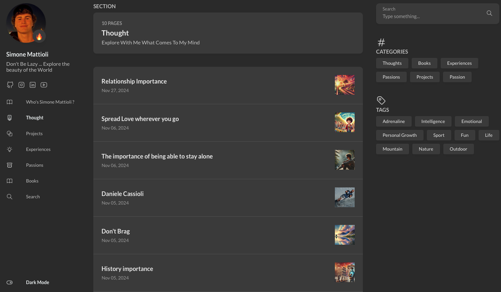

<!-- Banner -->


# 🌐 Simone Mattioli – Personal Website

Benvenuto nel repository del mio **sito web personale**, realizzato con [Hugo](https://gohugo.io) e il tema [Hugo Theme Stack](https://github.com/CaiJimmy/hugo-theme-stack).  
Questo sito è uno spazio dove condivido i miei progetti, passioni, contenuti fotografici e percorsi di crescita.

🔗 **Sito live**: [simo-hue.github.io/01_home/simone-mattioli](https://simo-hue.github.io/01_home/simone-mattioli/)  
📁 **Template di partenza**: [CaiJimmy/hugo-theme-stack](https://github.com/CaiJimmy/hugo-theme-stack)

---

## 🛠️ Tech Stack

- **Hugo** – Static Site Generator (Go-based)
- **Hugo Theme Stack** – Tema elegante e responsive
- **GitHub Pages** – Hosting gratuito tramite GitHub
- **Markdown** – Per la gestione dei contenuti
- **YAML / TOML** – Per la configurazione del sito

---

## 📷 Anteprima



> Se vuoi vedere il sito in azione:  
🔗 [https://simo-hue.github.io/01_home/simone-mattioli](https://simo-hue.github.io/01_home/simone-mattioli/)

---

## 🚀 Come Avviare in Locale

Per contribuire o testare il sito in locale:

```bash
git clone https://github.com/simo-hue/simo-hue.github.io.git
cd simo-hue.github.io
hugo server -D
```

> ⚠️ Assicurati di avere Hugo installato:  
👉 [Installazione Hugo](https://gohugo.io/getting-started/installing/)

---

## 📦 Deploy

Il sito viene pubblicato automaticamente su **GitHub Pages**.  
Puoi anche fare deploy manuale con:

```bash
hugo --minify
```

e poi caricare la cartella `public/` nel branch `gh-pages` o configurare un GitHub Action.

---

## 🧩 Risorse utili

📘 [Documentazione Hugo](https://gohugo.io/documentation/)  
🎨 [Tema Hugo Stack](https://github.com/CaiJimmy/hugo-theme-stack)  
🧪 [Guida GitHub Pages + Hugo](https://gohugo.io/hosting-and-deployment/hosting-on-github/)

---

## ✨ Credits

Creato e mantenuto da [Simone Mattioli](https://simo-hue.github.io).  
Tema basato su [Hugo Theme Stack](https://github.com/CaiJimmy/hugo-theme-stack).

---

## 📜 Licenza

Questo progetto è open-source e distribuito con licenza [MIT](./LICENSE).

---

⭐️ Se ti piace il progetto, lascia una **star** sulla repository!
