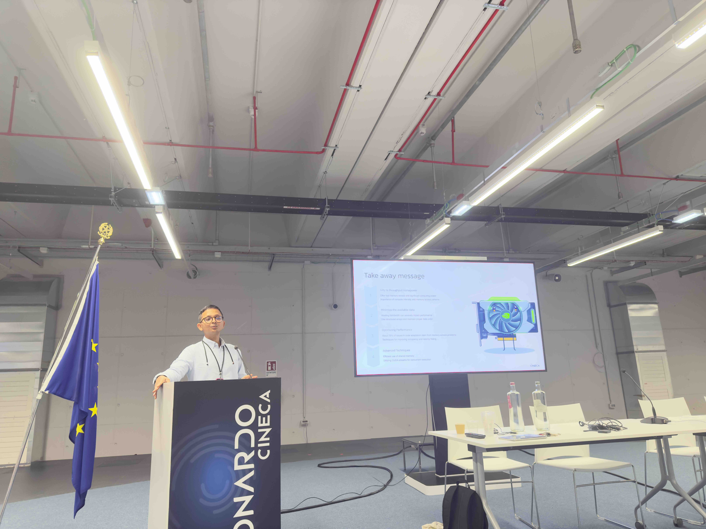

The **EPICURE Hackathon**, held from October 28-31, 2024, brought together developers, researchers, and enthusiasts from across Europe to dive deep into the world of **GPU programming and high-performance computing (HPC)**. This event was hosted in collaboration with **CINECA**, one of the leading HPC centers in Europe, renowned for its contributions to scientific computing and advanced research.

The hackathon was meticulously structured, featuring both hands-on labs and theoretical sessions, designed to empower participants with the latest skills in **CUDA programming**, **OpenACC**, and **GPU optimization techniques**.

## Day 1: Getting Started with GPU Computing

The first day served as an introduction to GPU computing, aimed at setting a strong foundation. Topics included:
- **Introduction to GPU Computing:** A look into the architecture and advantages of using GPUs for high-performance tasks.
- **CUDA Basics:** Practical insights into CUDA, NVIDIA's parallel computing platform, providing a gateway to harnessing the power of GPU cores.

The agenda for Day 1 was as follows:
  
| Time          | Session |
|---------------|---------|
| 9:00 - 9:15   | Welcome and Registration |
| 9:15 - 9:30   | EPICURE HPC Application Support for EuroHPC Users |
| 9:30 - 10:30  | Introduction to GPU Computing |
| 10:30 - 11:00 | Coffee Break |
| 11:00 - 12:30 | Introduction to CUDA |
| 12:30 - 14:00 | Lunch |
| 14:00 - 15:30 | OpenACC Programming and Profiling with Nsight |
| 15:30 - 16:00 | Coffee Break |
| 16:00 - 17:30 | OpenACC Programming and Profiling with Nsight |

**Images from Day 1:**

## Day 2: Advanced GPU Optimization and Profiling

Day 2 took things to the next level, focusing on **advanced GPU optimization and profiling techniques**. Participants were guided through various optimization methods to fine-tune GPU applications, reducing computation time and maximizing efficiency.

| Time          | Session |
|---------------|---------|
| 9:00 - 10:30  | Advanced GPU Optimization and Profiling |
| 10:30 - 11:00 | Coffee Break |
| 11:00 - 12:30 | Advanced GPU Optimization and Profiling (Continued) |
| 12:30 - 14:00 | Lunch |
| 14:00 - 17:30 | Lab Session (with your code or a provided code) |

The hands-on lab in the afternoon provided an opportunity to implement what we learned using real-world examples, supported by the CINECA team.

## Day 3-4: Intensive Lab Sessions

The last two days were dedicated to **intensive lab sessions**. Participants worked on challenging GPU computing projects, with mentors available to provide guidance and feedback. These sessions enabled us to:
- Test and debug our code using real-time feedback from experts.
- Engage in peer-to-peer learning, exchanging ideas and optimizing our implementations.
- Utilize **Nsight** and other profiling tools to analyze performance and identify bottlenecks.

| Date       | Morning (9:00 - 12:30) | Afternoon (14:00 - 17:30) |
|------------|-------------------------|----------------------------|
| October 30 | Lab Session             | Lab Session                |
| October 31 | Lab Session             | Lab Session                |

**Images from Days 3 and 4:**

## Key Takeaways

This hackathon was more than just a technical event; it was a community-building experience. Here are some of the main takeaways:
1. **Networking:** I had the opportunity to connect with like-minded individuals passionate about GPU programming and HPC.
2. **Learning New Tools:** From CUDA basics to advanced profiling with **Nsight**, I gained hands-on experience with cutting-edge tools.
3. **Real-World Problem Solving:** The projects and examples we tackled were grounded in real-world applications, highlighting the impact of GPU acceleration in domains like scientific research, machine learning, and data analysis.

## Final Thoughts

Reflecting on these four days, I feel a renewed enthusiasm for **GPU computing** and **HPC**. The skills I gained, combined with the amazing people I met, made this hackathon an unforgettable experience.

Interested in learning more? Check out the links below to access more details on EPICURE events, a recap video, and the GitHub repository with sample codes used during the hackathon.

**Links**

- [EPICURE HPC Event Page](https://epicure-hpc.eu)
- [Event Recap Video](https://www.youtube.com/watch?v=EPICURE_hackathon2024)
- [GitHub Repository of Sample Codes](https://github.com/EPICURE-hackathon-2024/sample-codes)

---

This hackathon has certainly sparked a deeper interest in exploring the potential of GPUs for high-performance tasks. I’m looking forward to applying these skills in future projects and sharing my insights with the community.

