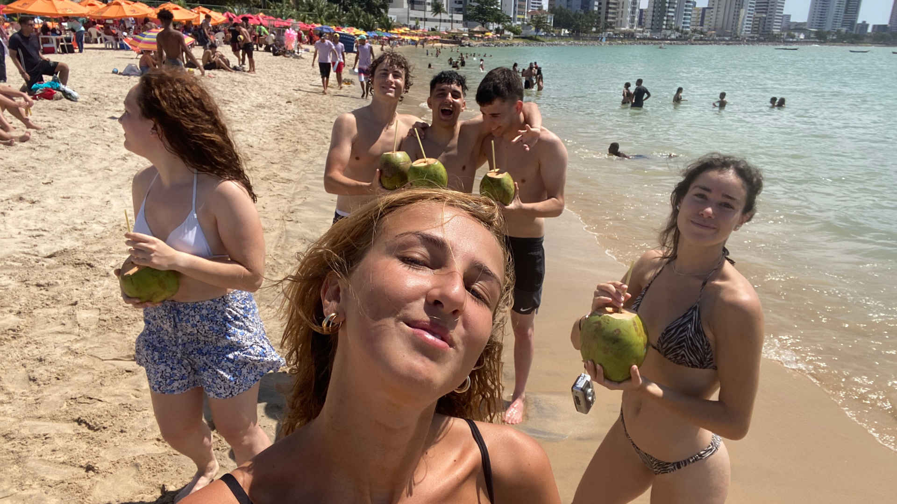
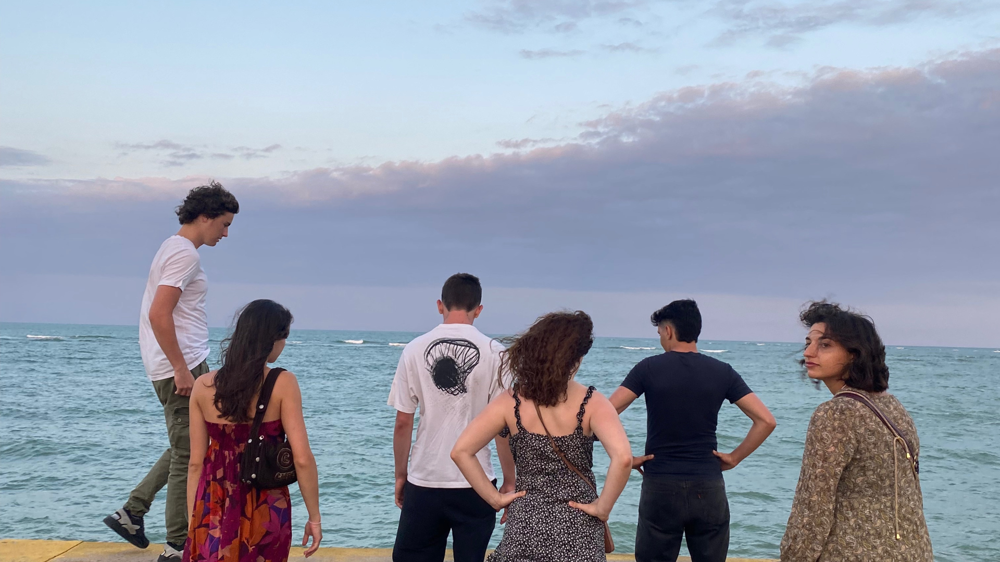
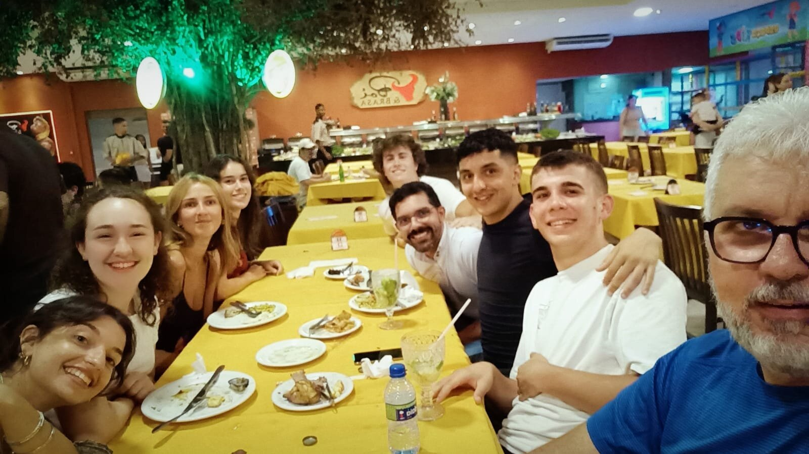

My 21st birthday was unique, an experience I will never forget. I spent it in Brazil, during my volunteering period, far from home and all my loved ones. On that occasion, I was not surrounded by the familiar faces of friends and relatives, but by six strangers, who shared with me the experience of volunteering in a country so different from mine.

I did not expect anything special. Usually, birthdays have never had a particular meaning for me, but that day turned out to be different, special, unique. Celebrating a birthday far from home and loved ones was a first step out of my comfort zone. It allowed me to live the moment with lightness and curiosity, immersed in a new experience.

### An Unexpected Surprise

What made my birthday truly memorable was the surprise that my travel companions organized. They found out only a few days later that I had turned 18, and they decided to surprise me with a surprise that left me speechless. One morning we woke up at 4:30, ready to go and watch the sunrise on the beautiful Brazilian beach of Cabo Branco.

I had no idea what to expect. We reached the beach, the sky was starting to turn warm, a prelude to dawn. It was then that they gave me a cake, prepared especially for me. We all shared it together, eating and enjoying the sunrise in one of the most beautiful places I have ever seen and then ending it in style with dinner with Don Eltom and Don Alberto who accompanied us on our volunteer experience in the Northeast of Brazil.

### A Moment of Pure Happiness

In those moments of simplicity and friendship, I felt truly happy. It was a moment of pure connection, of gratitude towards life and towards these people who, even if they had just met, had made that day special. I realized how precious it was to step out of my patterns and embrace what is new and unexpected that life has to offer.

### Advice from the Heart

If I can give you advice, it is to accept every experience that happens to you, even those that scare you or that seem difficult or "not made for you". Those experiences will change you and make you grow. Getting out of your comfort zone, experiencing the world with openness and curiosity: these are the things that will give you unforgettable moments.

That birthday away from home, in Brazil, taught me the value of sharing, friendship and adventure. It was an experience that I will always carry in my heart also with the other part of my journey there in Brazil doing volounteering activity

