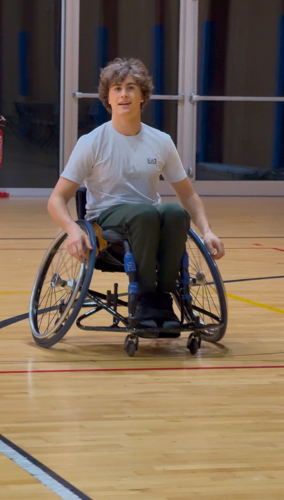

# An Experience That Changes Your Perspective: Wheelchair Basketball

Thanks to the extraordinary collaboration between **Collegio Don Mazza**, **Residenza Ferrari delle Spade di Verona** and **Olympic Basket Verona**, I had the opportunity to live one of the most significant experiences of my life: trying **wheelchair basketball**.

## A unique experience

This discipline goes far beyond a simple game. It is a real lesson in strength, determination and inclusion. Sitting in a wheelchair, picking up the ball and trying to move, shoot and collaborate with the rest of the team was enlightening.

I learned that sport is a universal language, capable of breaking down all types of barriers – physical, mental and cultural. It was an opportunity to see the world from a completely different perspective, to recognize the daily challenges that many athletes face and to appreciate their commitment and resilience.

## Sport as a driver of inspiration

As Nelson Mandela said:
> *“Sport has the power to change the world. It has the power to inspire. It has the power to unite people like few other things in the world.”*

This is exactly what I felt during this experience. Sport is a powerful tool to overcome limits and to build authentic bonds with those around us.

Another phrase that strongly resonates with this experience is that of John Wooden:
> *“Don’t let what you can’t do get in the way of what you can do.”*

Wheelchair basketball shows that with passion, determination and team spirit there are no insurmountable obstacles.

## Olympic Basket Verona: a reality to discover

A special thanks goes to **Olympic Basket Verona**, a reality that represents a true example of inclusion and promotion of sport for all. If you want to know more about them, here's where you can find them online:
- **Facebook**: [Olympic Basket Verona](https://www.facebook.com/OlympicVerona/)
- **Instagram**: [@olympic_basket_verona](https://www.instagram.com/olympic_basket_verona/)

## Watch the video of my experience

If you want to immerse yourself in this unique experience, take a look at the video I made:



---

💡 **And you? Have you ever had an experience that helped you change your perspective?** Tell me in the comments or contact me directly, I'd love to hear your story!

### Hashtags for sharing
#Inclusion #WheelchairBasketball #SportForAll #Determination #Resilience #BreakingBarriers #Teamwork #Inspiration #OlympicBasketVerona