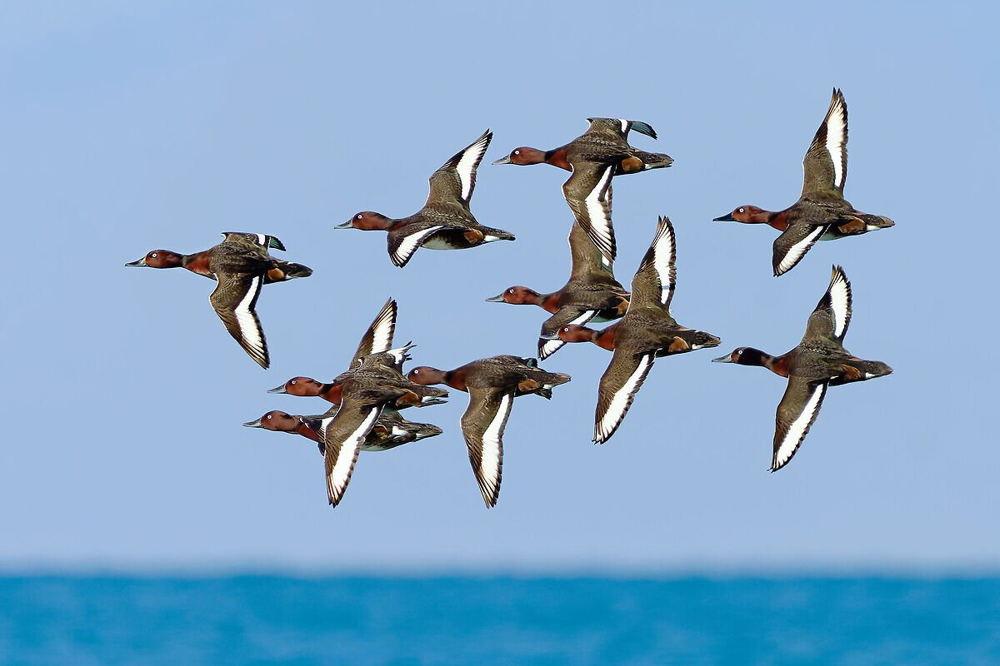
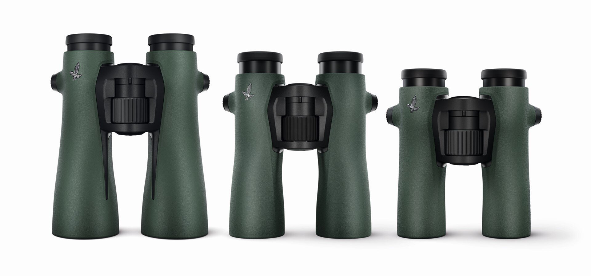
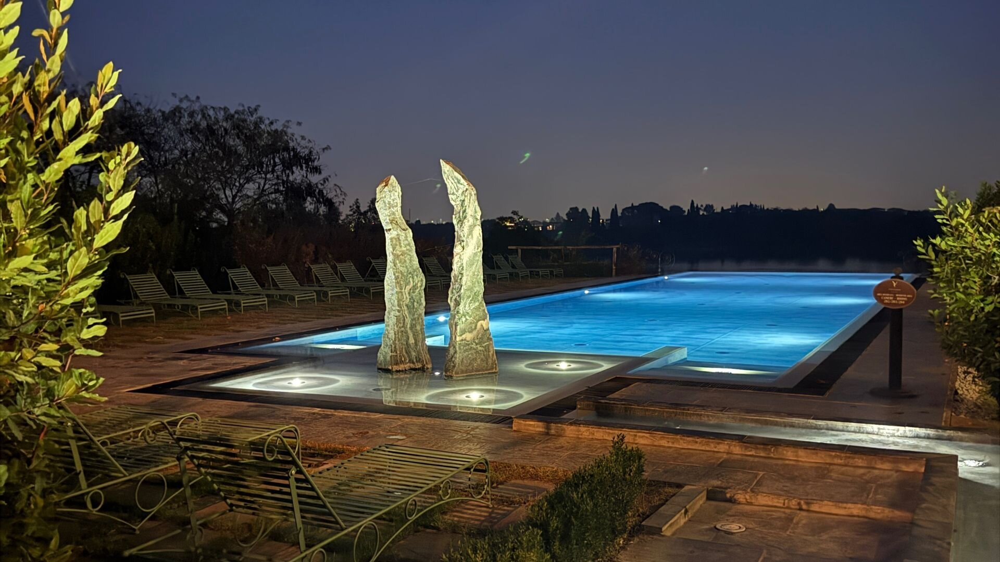

Recently, thanks to my project *Mountain Fauna Lover*, I had the chance to participate in an exclusive event organized by SWAROVSKI OPTIK Italy at the stunning Frassino Oasis in Peschiera del Garda. 

*Mountain Fauna Lover* began almost as a joke, born from my love for mountains and wildlife. I never imagined it would open doors to such exciting collaborations. 

Through this project, I’ve been able to experience nature up close, often alongside experts and using top-tier equipment, making each adventure more unforgettable than the last.

This time, we were immersed in an extraordinary birdwatching experience with expert guidance and SWAROVSKI OPTIK’s impressive tools, including the NL X52 binoculars and the BTX spotting scope. The day began with a presentation by SWAROVSKI OPTIK Italy’s manager, Franco Cernigliaro, and ornithologist Alessandro Sartori, who introduced us to the bird species we’d encounter.

During my meeting with Franco Cernigliaro, the Country Manager of Swarovski Optik Italy, we exchanged inspiring ideas and perspectives on biodiversity and sustainability. It was a remarkable experience to engage with someone equally dedicated to nature and innovation. Our discussion centered on how these themes are fundamental to Swarovski’s mission—not just as marketing strategies but as true core values. 
Swarovski Optik actively encourages deeper connections with nature and is committed to supporting sustainable practices and environmentally responsible technologies in their high-precision optics products

The observation was incredible—Red-crested Pochards, Tufted Ducks, Teals, and, with a bit of luck, a Marsh Harrier—all appeared in their full beauty, enhanced by the sharpness and clarity of SWAROVSKI’s optics.

This project has allowed me to build connections with companies like SWAROVSKI OPTIK and explore the world of wildlife in inspiring ways. Who knows what the future holds for *Mountain Fauna Lover*… perhaps it will grow from a simple passion into something even greater. Stay tuned for more adventures!