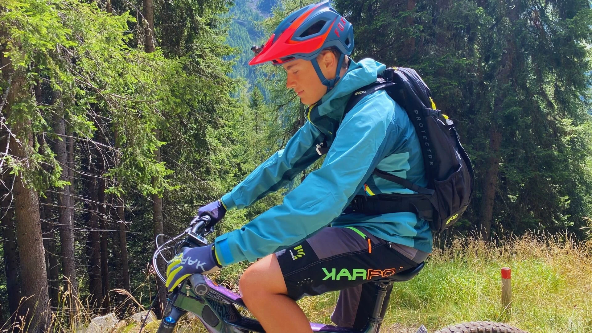

This blog is all about the adrenaline, freedom, and connection with nature that mountain biking has brought into my life. Ever since my first ride, I was hooked—there’s nothing like the thrill of hitting rugged trails, mastering new terrain, and feeling the rush of carving through mountainsides. 
From discovering the best gear and customizing my setup to push my limits, to the pure satisfaction of conquering new trails, mountain biking has become more than a sport—it’s a passion. Here, I’ll share tips, personal stories, trail reviews, and everything that makes mountain biking an adventure worth chasing. Whether you’re a seasoned rider or a curious beginner, join me in exploring the world on two wheels!