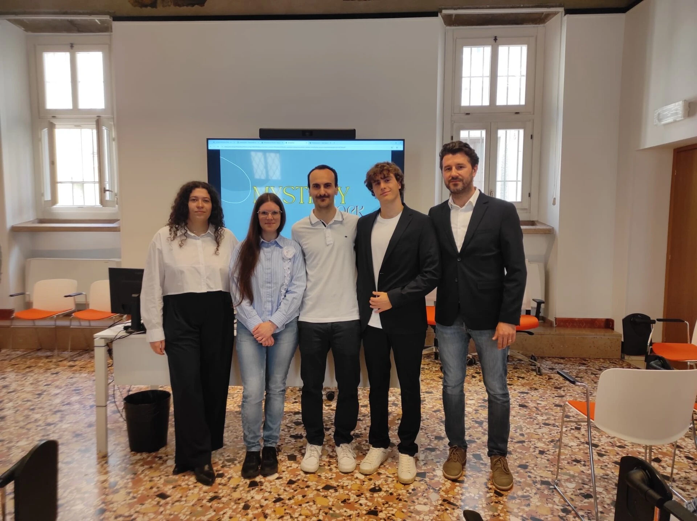

# 🚀 Redevelopment of the Rocca di Nogarole: Our Journey with CLab Verona

The journey of the **Contamination Lab (CLab)** at the University of Verona was much more than a simple project: it was an adventure, an exciting challenge that allowed my team and I to explore new skills, tackle real obstacles, and above all, create concrete ideas for our community.

## 🌿 Our Goal: Revitalize the Rocca di Nogarole

The heart of our challenge was to propose innovative ideas to redevelop the splendid and historic Rocca di Nogarole. A symbolic monument, rich in history, it deserved to be enhanced and revived as a cultural, social, and tourism center, bringing tangible benefits to the local community.

## 💡 The Journey: Growth, Innovation, and Collaboration

During this journey, we had the opportunity to attend targeted workshops, brainstorming sessions led by qualified mentors, and meetings with experts from various fields. The CLab taught us not only how to work as a team, but also how to think "outside the box," tackling real-world problems with creativity and pragmatism.

In this article, you will find:

- 📚 The training materials provided to us during the project
- 🛠️ All the materials produced by our team during the project (presentations, documents, analyses, etc.)

## 🎉 A special thank you to the Team

I can only thank my extraordinary fellow travelers: each contributed their own ideas, skills, and enthusiasm to making this journey unique. It was a true pleasure working alongside you.

## 🌟 A great shared experience

I also share a photo of all the CLab Verona participants: each person in this photo brings with them ideas, dreams, and skills that can truly change our future.

## 📥 Project Documents

Below are the main documents of our CLab project, available for consultation and further study:

### 📋 Main Documents

- [📄 Complete Business Plan](materiali%20prodotti/DA%20MANDARE%20AL%20COMUNE/Business%20Plan.pdf) - Detailed business plan for the redevelopment
- [📊 Financial Plan Dashboard](materiali%20prodotti/DA%20MANDARE%20AL%20COMUNE/Financial%20Plan%20-%20Dashboard.pdf) - Economic and financial analysis of the project
- [📈 Financial Plan (Excel)](materiali%20prodotti/Financial%20Plan.xlsx) - Complete financial model
- [🎯 MisteryRock - Final Project](materiali%20prodotti/DA%20MANDARE%20AL%20COMUNE/MisteryRock.pdf) - Final proposal for the Municipality

### 🏆 Participation Certificates

- [📜 Mattioli Simone - Participation Certificate](attestati/Mattioli.pdf) - Personal participation certificate
- [📜 General Participation Certificate](attestati/partecipazione.pdf) - General participation documentation

### 📚 Study and Research Materials

All **study materials** used during the training program (kick-off, territorial analysis, governance, ESG communication, etc.) are available for download in a comprehensive archive:

- [📦 Download Study Materials (ZIP)](materiali-di-study.zip) - Over 40 research and training files used to develop the skills needed for the project

---

Thank you for visiting this page and for your interest in our journey. We hope our work can be a source of inspiration for future projects and for anyone who wants to get involved in making a real difference.

✨ **Let's continue to innovate together!** ✨

#CLabVerona #Redevelopment #RoccaDiNogarole #Innovation #Growth #Teamwork