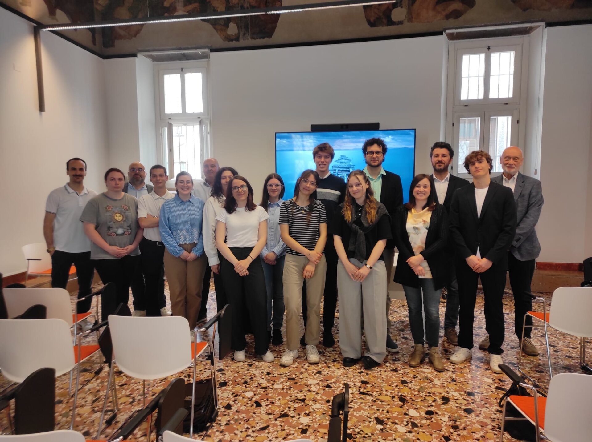

# 🚀 Riqualificazione della Rocca di Nogarole: Il nostro viaggio con il CLab Verona

Il percorso del **Contamination Lab (CLab)** dell'Università di Verona è stato molto più che un semplice progetto: è stata un'avventura, una sfida appassionante che ha permesso a me e al mio team di esplorare nuove competenze, affrontare ostacoli reali e soprattutto creare idee concrete per la nostra comunità.

## 🌿 Il nostro obiettivo: Dare nuova vita alla Rocca di Nogarole

Il cuore della nostra sfida era proporre idee innovative per riqualificare la splendida e storica Rocca di Nogarole. Un monumento simbolo, ricco di storia, che meritava di essere valorizzato per tornare a vivere come centro culturale, sociale e turistico, portando benefici tangibili alla comunità locale.

## 💡 Il percorso: Crescita, Innovazione e Collaborazione

Durante questo percorso abbiamo avuto la possibilità di seguire workshop mirati, sessioni di brainstorming guidate da mentor qualificati e incontri con esperti provenienti da diversi settori. Il CLab ci ha insegnato non solo come lavorare in team, ma anche come pensare "fuori dagli schemi", affrontando problemi reali con creatività e pragmatismo.

In questo articolo troverete:

- 📚 Il materiale formativo che ci è stato fornito durante il percorso
- 🛠️ Tutto il materiale prodotto dal nostro team durante il progetto (presentazioni, documenti, analisi, ecc.)

## 🎉 Un ringraziamento speciale al Team

Non posso che ringraziare i miei straordinari compagni di viaggio: ognuno ha contribuito con le proprie idee, competenze ed entusiasmo a rendere unico questo percorso. È stato un vero piacere lavorare al vostro fianco.

## 🌟 Una grande esperienza condivisa

Condivido anche una foto di tutti i partecipanti del CLab Verona: ogni persona in questa foto porta con sé idee, sogni e competenze che potranno cambiare concretamente il nostro futuro.

## 📥 Allegati e Risorse

Di seguito potete trovare tutto il materiale relativo al nostro progetto e al percorso del CLab, disponibile per chiunque desideri approfondire o trarre ispirazione:

- Materiale formativo
- Documentazione del progetto finale
- Risultati delle nostre analisi

---

Grazie per aver visitato questa pagina e per esserti interessato al nostro viaggio. Speriamo che il nostro lavoro possa essere fonte d'ispirazione per progetti futuri e per chiunque voglia mettersi in gioco per cambiare le cose concretamente.

✨ **Continuiamo a innovare insieme!** ✨

#CLabVerona #Riqualificazione #RoccaDiNogarole #Innovazione #Crescita #Teamwork
