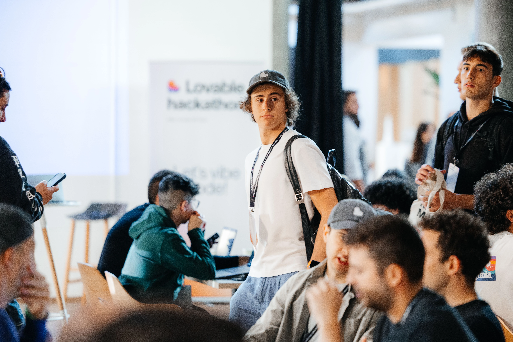
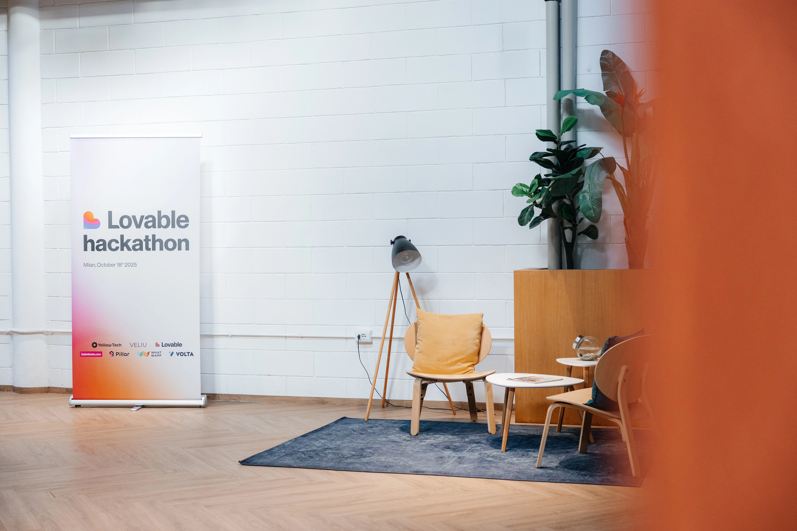
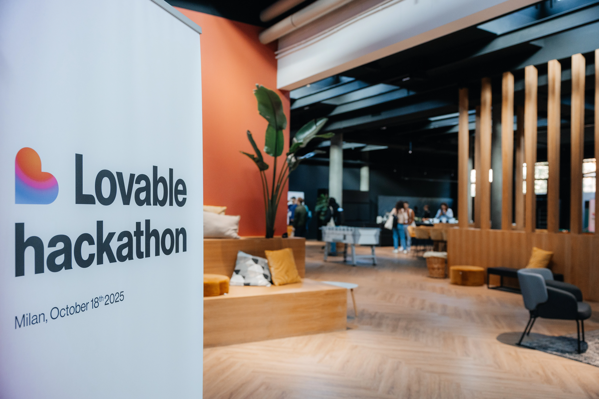
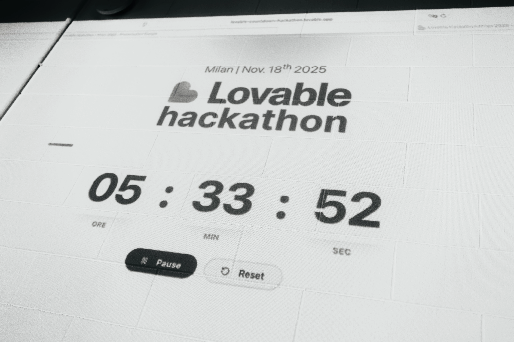
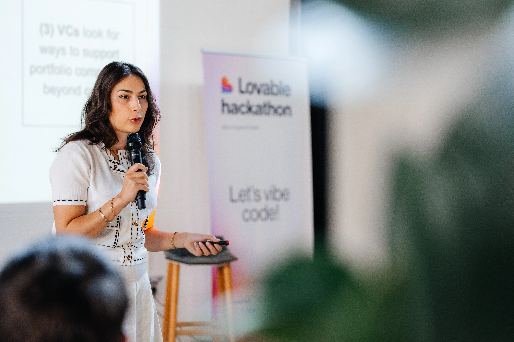
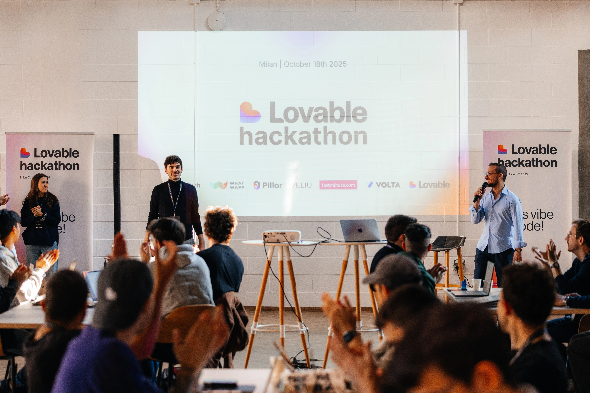

### 80 out of 500+. That's the number I still can't believe.

*Arrival at Caravaggio 37, Milan - October 18, 2025*

When I received the confirmation email to participate in the first Italian Vibe Coding hackathon, organized by **Yellow Tech** with the **Lovable** platform, I had to read it twice to believe it was true.

Over **500 people** had applied to participate. Only **80** from all over Europe were selected.

Being among these 80 people was an honor that I still deeply feel today.

---

## The Context: A Revolution Called Vibe Coding

Before I tell you what happened that day, let me explain what **vibe coding** is.

Vibe coding is a new paradigm in software development: an approach in which applications, websites, and digital tools are created by engaging with artificial intelligence, without ever directly touching the code.

This isn't traditional no-code or low-code. It's something deeper: you're literally conversing with AI to build your product, just as you would explain your vision to a fellow developer.

Lovable is one of the world's leading platforms in this sector. And it has chosen Milan for its official Italian debut, appointing Antonio Pisante (CEO of Yellow Tech) as the brand's first Italian ambassador.

---

## The Location: Caravaggio 37, the Heart of Milan's Innovation

*The open spaces where the hackathon took place*

The event was held at **Caravaggio 37**, in Milan's Certosa district. A modern, bright space, perfect for hosting a community of innovators.

As soon as I entered, I felt the energy: tables full of laptops and, above all, **people**.

Startup founders, university students, AI professionals, hackers, curious developers. All with the same goal: to push themselves beyond their limits.

---

## The Challenge: Cloning Tech Giants in 6 Hours

**10:00 AM** - Official opening of the hackathon.

**Sophia Gustafsson**, Community & Growth Lead at Lovable, takes the stage with Antonio Pisante. They explain the challenge:

> "You have 6 hours. Your goal is to create a working clone of some of the most successful products in tech history: **Airbnb**, **Slack**, **Shopify**."

Silence in the room.

Then a nervous laugh. Cloning Airbnb in 6 hours? Without writing code?

But Sophia continues with a smile:

> "Clearly, they won't be identical, and they won't have all the features. But you'll have to create something that works, with a credible interface and complete user flows. Something that demonstrates the potential of vibe coding."

**Game on.**

---

## My Project: Snooze & Go

### The Result

After 6 intense hours of iterations, prompt engineering, and testing, I delivered the project.

👉 **[Try Snooze & Go here](https://preview--snoozeandgo.lovable.app/?from=2025-11-19&to=2025-11-20)**

It works. It's fast. It's credible.

And I built it without writing a single line of code.

---

## Moments of Fun: Networking Between Features

*Informal networking during breaks - who says you can't network while playing ping pong?*

One of the best things about this hackathon was the **atmosphere**.

It wasn't a toxic competition where everyone jealously guards their own project. It was a **collaborative** environment, almost like a creative jam session.

During breaks:

- I played ping pong with an AI startup founder who gave me amazing advice on prompt engineering
- I discussed growth strategies with college students who had brilliant ideas
- I exchanged LinkedIn contacts with professionals I now follow with interest

The networking was spontaneous, genuine, and invaluable.

When you put 80 curious minds in a room with powerful tools and shared goals, magic happens.

---

## What I Learned About Vibe Coding

### 1. Prompting Is the New Coding

The quality of the result depends on the precision with which you describe the problem.

You can't just say, "I want a button." You have to say:

> "Create a primary CTA with color #2563EB, rounded border, hover state with transparency, that opens a confirmation modal with email validation and error handling when clicked."

As in traditional coding, precision matters. But now it's expressed in human language.

### 2. Iteration Is Instant

**Traditional Approach:**
Write Code → Compile → Test → Debug → Repeat (time: 20-30 minutes per cycle)

**With Vibe Coding:**
Describe → View → Refine → Repeat (time: 2-3 minutes per cycle)

I did over **40 iterations** in 6 hours. This would have been impossible with traditional approaches.

### 3. The Focus Shifts From the "How" to the "What"

I didn't waste any time:
- Configuring Webpack
- Managing dependencies
- Debugging incompatible CSS between browsers
- Troubleshooting CORS issues

I was able to focus on:
- **User Experience**
- **User Flows**
- **Value Proposition**
- **Competitive Differentiation**

The code is generated. **You drive the vision**.

---

## People I Met

### Sophia Gustafsson - Lovable

Sophia was there all day, not only as a judge but as an **active community member**.

We talked about how vibe coding is changing market dynamics, how the barriers to entry in software development are dramatically lowering, and how this opens up opportunities for millions of people.

### Antonio Pisante - Yellow Tech

Antonio, CEO of Yellow Tech and the first Italian ambassador for Lovable, led the event with a clear vision:

> "Vibe coding has the potential to democratize software creation, breaking down technical barriers and opening new opportunities for startups, companies, and individual creators."

His energy and passion for accessible innovation were contagious.

### The Other 79 Attendees

Founders, students, professionals, hackers. Each with their own background, skills, and ambitions.

But all united by the same curiosity: what happens when AI breaks down technical barriers?

I collected dozens of business cards, added contacts on LinkedIn, and started conversations that I hope will continue well beyond this event.

---

## Final Thoughts: What It Really Means to "Democratize" Software Development

On the way home that evening, I thought a lot about a word that was repeated dozens of times during the event: **democratization**.

What does it really mean to democratize software development?

It means that:

- A **marketer** can build an internal tool in an afternoon without waiting for the tech team
- A **student** can validate a business idea without seeking a technical co-founder
- A **founder** can iterate on the product 10 times before launching, without burning a budget
- A **non-tech** professional can automate their workflows without depending on others

We're not just talking about **speed**. We're talking about **who can participate** in creating technology.

And that changes everything.

---

## The Future Is Already Here

Saturday, October 18, 2025, wasn't just a hackathon.

It was a glimpse of the future of work. A future where:

- Ideas matter more than code
- Creativity trumps syntax
- Natural language is the primary interface

**The question isn't whether vibe coding will become mainstream.**

The question is: **Are you ready for a world where anyone can build?**

I chose to be there.

And you?

---

## Links and Resources

- 🚀 **[Snooze & Go - My Project](https://preview--snoozeandgo.lovable.app/?from=2025-11-19&to=2025-11-20)**
- 🔗 **[Lovable](https://lovable.dev)** - The vibe coding platform
- 🟡 **[Yellow Tech](https://www.yellowtech.it)** - AI training and integration in Italy
- 📍 **Location:** Caravaggio 37, Milan
- 📅 **Date:** October 18, 2025