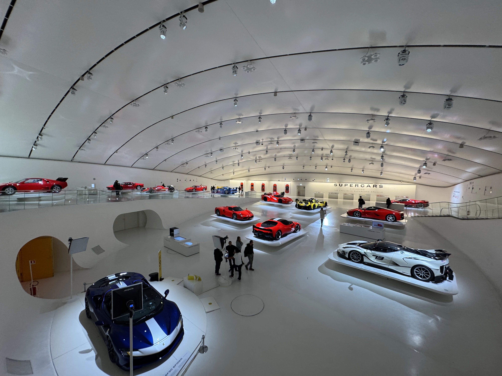
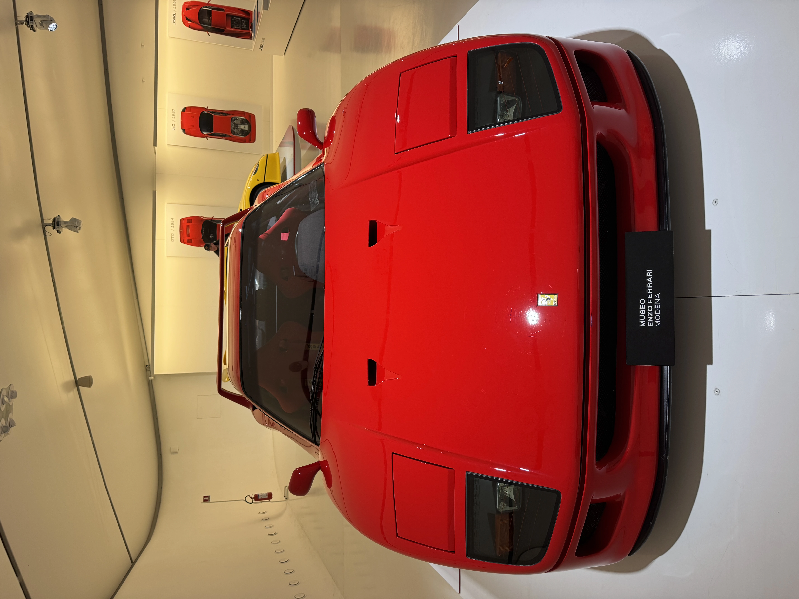
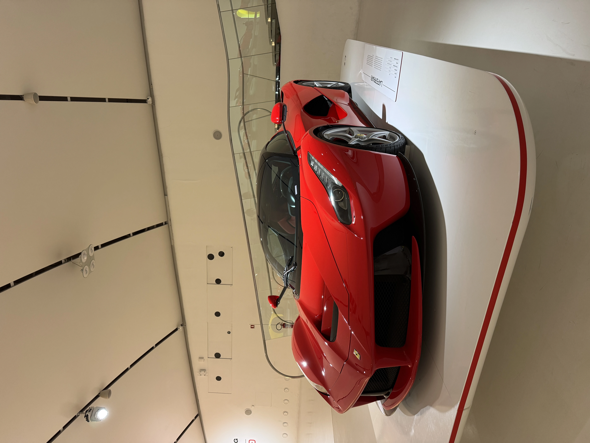
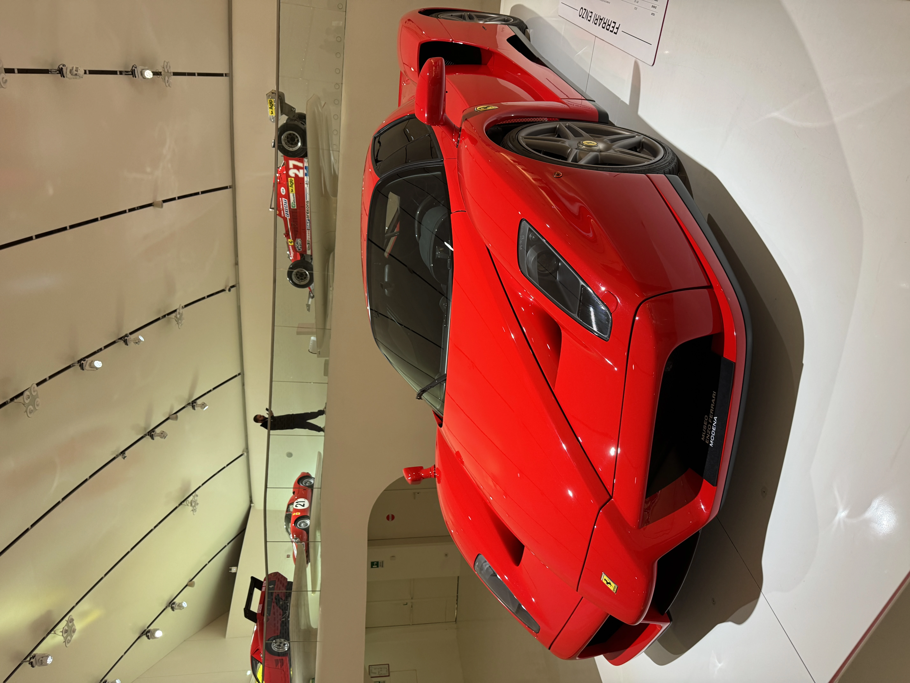
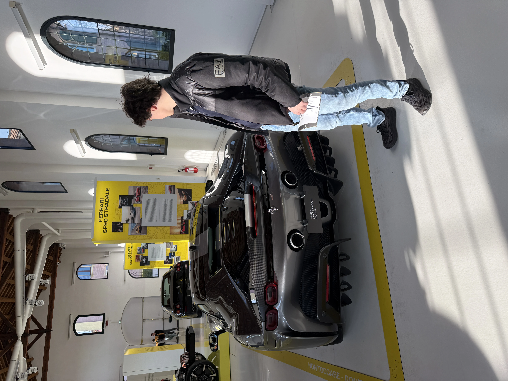
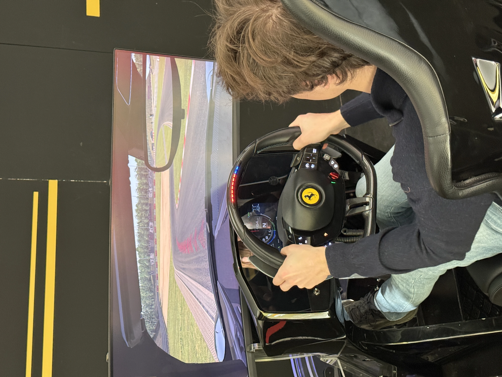

---
categories:
- thoughts
date: 2026-01-12
description: "A memorable trip to the Ferrari museums in Maranello and Modena with my dad, seeing legendary cars like the F40 and living the dream."
draft: false
image: cover.png
slug: live-the-dream
tags: []
title: Live the dream
---

## Where did it all begin?
It all started because we had to stay in Rovereto (and not go up as usual to Val di Rabbi) for the weekend.

So my idea was... why NOT go to Maranello? We passed by it once when I was going to Casellacce (Swarovski) to return the equipment lent to me and I felt a pang in my heart as a super car enthusiast.

## The plan?
And so here is the Saturday of dreams:
- Departure in the morning from Rovereto towards the Ferrari Museum in Maranello
- After the museum, a walk around the city in the surroundings of the factory and Ferrari offices (where there are supercars on every corner)
- Once the walk is finished, lunch and then immediately to the Enzo Ferrari Museum in Modena

## It's more than just a museum

On paper it seems very exciting, yes but quite classic while what it means for me is much, much more than a simple: "SEEING AN ITALIAN AND WORLD MASTERPIECE".

I am obsessed with engines, for me they are a drug (positive, but they are) and clearly as the sign said before entering the museum: "LIVE THE DREAM!" for me it doesn't want to be just a dream, because for now it is (or rather it is a goal) and probably for a few years it will remain so, but I am certain that I will manage to achieve it.

It was something magical to say the least, seeing all the cars that I always and only see on YouTube in reality... being able to appreciate every single detail, whether in carbon or not. But in general just being able to be there, just me and the car admiring it as if time stopped and I looked at it from top to bottom with heart eyes 😍.

## The greatest wealth

Certainly, to be able to afford these "adult toys" it doesn't take little money.... quite the contrary!

Also because as always, the things I like coincidentally are always the most expensive... and in this case:
- Ferrari F40

- Ferrari LaFerrari

- Ferrari Enzo

- Ferrari SF90

- And I could go on for a long time, really long (believe me)

All this to say what? Well essentially I was there with my dad, who has become passionate about engines but not at my level yet I saw him very happy even if I made him do the museum slowly and made him walk all over Maranello to see EVERYTHING. From the historic entrance of Ferrari to the Fiorano track.

But it was another moment where I realized even more that I am a much more fortunate and privileged person...

Exited from the Maranello museum (from the turnstiles) the adrenaline had gone down... no more crazy vehicles to observe now (also because I thought that was the most beautiful museum, and instead!) but there was the room of DRIVING SIMULATORS.

I clearly approached for technical curiosity (as a computer scientist) and wanted to understand how it worked properly because they were NON-amateur simulators (even if not super mega professional like those of the pilots, but a solid middle ground).

So dad asks me if I wanted to do it, but I clearly tell him no also because it was paid and I certainly didn't want to play the spoiled child who asks for things (something I never wanted and never managed to do).

Dad however insisted and even though I kept telling him "no", "no, seriously" he went to the checkout and bought "the simulator experience".
Clearly the thing I told him as soon as he arrived with the ticket was: "Come on please you do it". But nothing to do, and I did it.

Obvious is that it was a super beautiful experience, but what I appreciated most was the fact of the spontaneity with which dad made this gesture to "make me happier" or anyway to entertain me and this has no equals and is an unparalleled gesture (you read that right, it far exceeds a test drive in a Ferrari or anything else).

Speaking of test drives, when we left he wanted me to do that too and enter the building next to the museum to understand the rates... something that there yes I refused because obviously it is a unique experience, however certainly it is an absurd waste of money because next to the museum it is certainly a super tourist trap thing.

But even there dad didn't give up immediately, but also here he said a sentence, which for many can result insignificant but to me warmed the heart and NOT a little: "I would like to let you drive a Ferrari!".
Just repeating it (and hearing his voice again while he said these words) a tear drops from emotion... someone will consider me crazy/stupid or whatever else, but what I can say is that he knows when for me cars are an important thing and when they excite me and make me happy... and it is precisely for this reason that everything there was to do he wanted me to do to ensure that my experience was the best possible.

I must say that he succeeded without any doubt, he gave me a day that is to be framed and remembered as MEMORABLE!

PS: Also at the second museum (Enzo Ferrari Modena) the same thing happened with other simulators (instead of F1 it was SF90) and so I did the lap on those too...

And besides the:
> "If you can dream it, you can do it" – *Enzo Ferrari*

And

> "The best Ferrari ever built is the next one" – *Enzo Ferrari*

I can humbly add that

> "Too often we focus on 'what we don't have' (which is often useless) when in reality we have something unique in our hands to which however we do not give enough importance and attention" – *Mattioli Simone*

