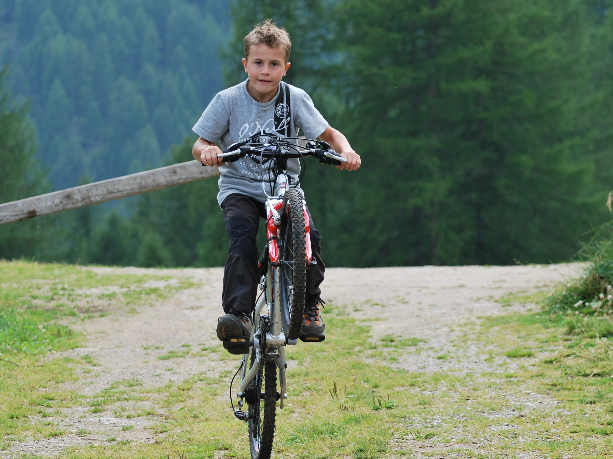
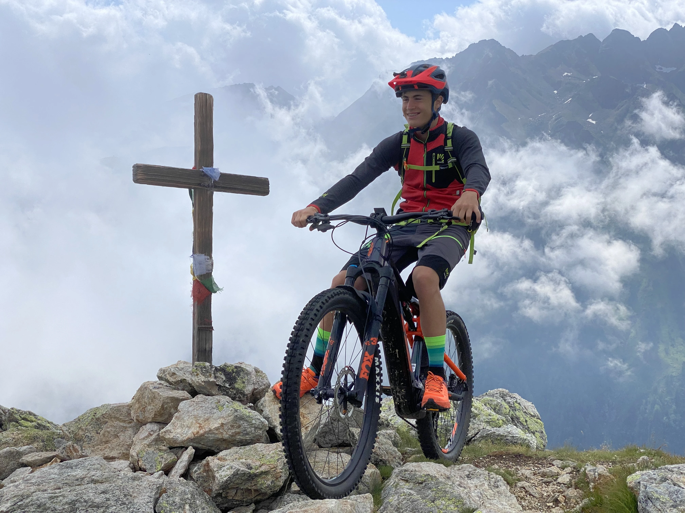
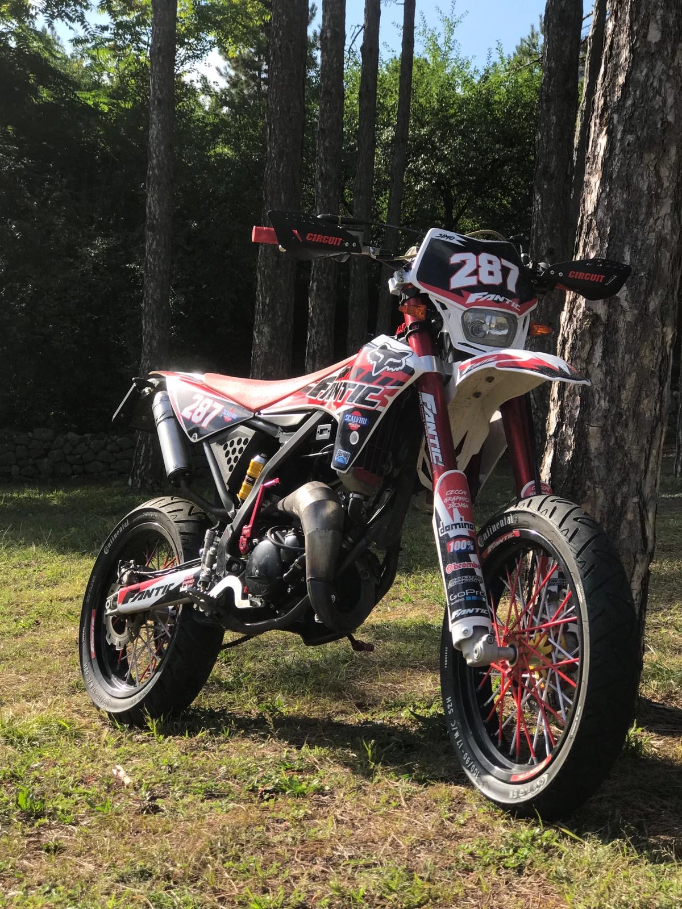

# Mountain Bike and E-Bike

It's always been an outlet for me, I get on the bike and I don't think about anything anymore...I transform and with me the whole world because I no longer have stress but pure happiness.

Of course, many people think I'm crazy for how I ride the bike given my recklessness, which I was already developing when I was little (as you can see from here)

For now I'm still alive and all in one piece...but I get on the bike always with a smile in pursuit of my carefreeness and happiness...just like when I drive (but with a bit more adrenaline)

# Motorcycle

This has always been my dream...to have my own bike.

After so many years spent trying to convince my parents, well yes I managed to get it and after so much care and passion I built it in my own image and likeness...

Oh well...I was really so proud of it. I say was because even though I had a lot of fun, and I also risked quite a few times some big damages...but despite everything I never stopped loving it and taking care of it with all my heart.

One thing is certain though...being that it was my first bike I didn't have much confidence and for this reason unfortunately I didn't enjoy it 100% because there was always the "respect" towards it due to my lack of experience.

# The Forbidden Dream

it's always been the KTM 125cc, and even though my parents expected the natural request/evolution once I got my A1 license...

I resisted this temptation because being a dream I want to deserve it and I do NOT want it as a gift.